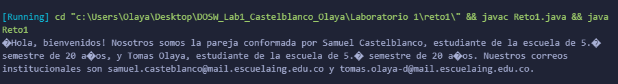

# Maratón Git 2026-1

## Integrantes
- Tomas Olaya Diaz  
- Samuel Felipe Castelbalnco Tellez  

---

## Retos completados

### Reto 1: Configuración y creación de rama 

**Evidencia**

**Descripción:**  
Se implementó una solución de **Programación Funcional** en Java para generar un saludo automatizado.
* Se creó la clase interna `Estudiante` para modelar los datos (nombre, correo, edad, semestre).
* Se utilizó la **API Stream** y expresiones **Lambda** (`.map()`, `.collect()`) para transformar y concatenar la información de la lista de estudiantes sin usar bucles tradicionales.
* El resultado es una cadena de texto formateada dinámicamente según los requisitos del laboratorio.

---

### Reto 2: Commit colaborativo  
**Evidencia:**  
Captura de imagen  

**Descripción:**  
Breve explicación de cómo se realizó el trabajo colaborativo, cómo se integraron los cambios, y más detalles relevantes.

---

## Preguntas teóricas

- **Pregunta 1:**  
Respuesta...

 