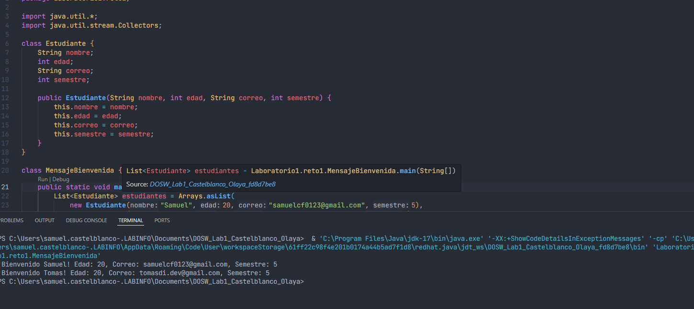

# Maratón Git 2026-1

## Integrantes
- Samuel Felipe Castelblanco Tellez
- Tomas Olaya Diaz

---

## Retos completados

### RETO #1: La Bienvenida
**Evidencia:**  

**Descripción:**  
Se resolvio el reto 1 por medio de una fucnio lamda la cual impreme los nombres que se pasan anteriormente en una list

---

### Reto 2: Commit colaborativo  
**Evidencia:**  
Captura de imagen  

**Descripción:**  
Breve explicación de cómo se realizó el trabajo colaborativo, cómo se integraron los cambios, y más detalles relevantes.

---

## Preguntas teóricas

- **Pregunta 1:**  
Respuesta...
